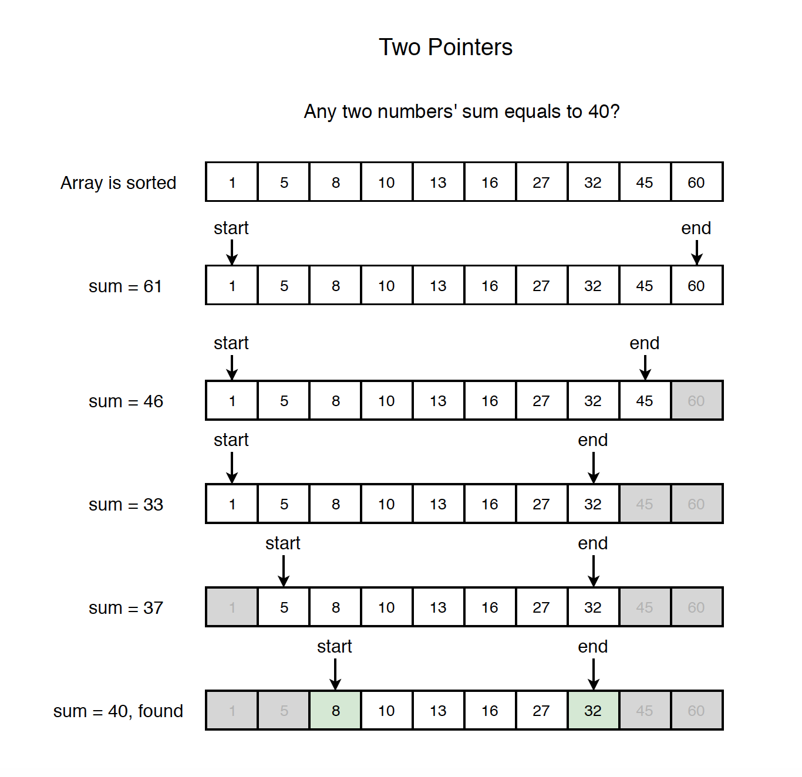
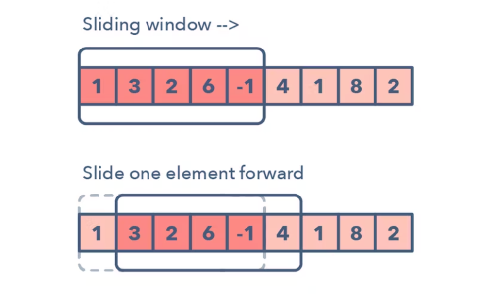
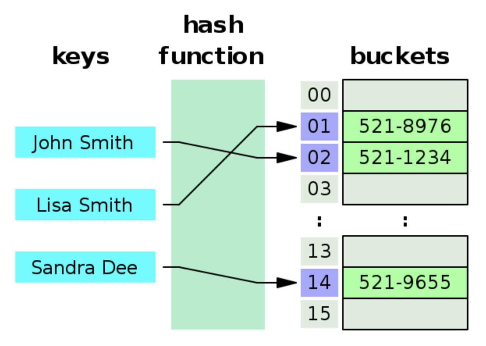

## ✔️ Section5: 효율성

| No. |        문항        | 진행 상황 |                관련 개념                 |
| :-: | :----------------: | :-------: | :--------------------------------------: |
| 01  |   두 배열 합치기   |    ☑️     |            투포인터 알고리즘             |
| 02  |  공통 원소 구하기  |    ☑️     |            투포인터 알고리즘             |
| 03  |  연속 부분 수열 1  |    ☑️     |            투포인터 알고리즘             |
| 04  |  연속 부분 수열 2  |    ☑️     |            투포인터 알고리즘             |
| 05  |     최대 매출      |    ☑️     |             슬라이딩 윈도우              |
| 06  |     학급 회장      |    ☑️     |                 해쉬 맵                  |
| 07  |      아나그램      |    ☑️     |                 해쉬 맵                  |
| 08  | 모든 아나그램 찾기 |    ☑️     | 투포인터 알고리즘, 슬라이딩 윈도우, 해쉬 |

### Two-Pointer Algorithm

- 1차원 배열에서 각자 다른 원소를 가리키고 있는 2개의 포인터를 조작해가면서 원하는 값을 찾을 때까지 탐색하는 알고리즘
- 리스트에 순차적으로 접근해야 할 때 두 개의 포인트의 위치를 기록하면서 처리한다.
- 구간의 넓이가 조건에 따라 유동적으로 변한다.

### Sliding-Window Algorithm

- 고정 사이즈의 윈도우가 이동하면서 윈도우 내에 있는 데이터를 이용해 문제를 풀이하는 알고리즘
- 교집합의 정보를 공유하고 차이가 나는 양쪽 끝 원소만 갱신하는 방법
- 배열이나 리스트 요소의 일정 범위의 값을 비교할 때 유용하게 사용할 수 있다.
- 항상 구간의 넓이가 고정되어 있다.

### Hash Algorithm (Hash Function)

- 임의의 길이의 데이터를 고정된 길이의 데이터로 매핑하는 함수
- 큰 파일에서 중복되는 기록을 찾을 수 있어 DB 검색이나 테이블 검색의 속도를 가속할 수 있다.
- 특정한 배열의 인덱스나 위치나 값을 이용해 저장하거나 찾을 수 있다.
