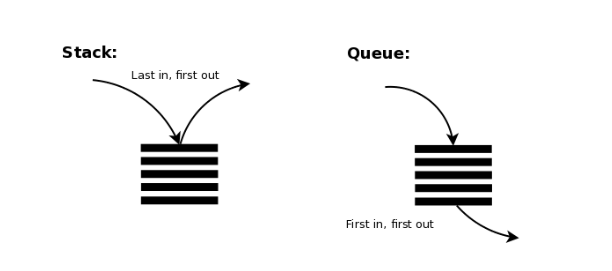

## ✔️ Section6: 자료구조

| No. |         문항          | 진행 상황 | 관련 개념 |
| :-: | :-------------------: | :-------: | :-------: |
| 01  |      올바른 괄호      |    ☑️     |   스택    |
| 02  |    괄호 문자 제거     |    ☑️     |   스택    |
| 03  |   크레인 인형 뽑기    |    ☑️     |   스택    |
| 04  | 후위식 (postfix) 연산 |    ☑️     |   스택    |
| 05  |       쇠 막대기       |    ☑️     |   스택    |
| 06  |      공주 구하기      |    ☑️     |    큐     |
| 07  |    교육 과정 설계     |    ☑️     |    큐     |



### 🚦 STACK

- 후입선출, LIFO (Last In First Out)
- 쌓아 올린 형태의 자료 구조
- 같은 구조와 크기의 자료를 정해진 방향으로만 쌓을 수 있고 정해진 위치에서만 접근할 수 있다.
- 가장 위 TOP에 있는 자료는 가장 최근에 들어온 자료를 가리키며 삽입되는 자료가 그 위에 쌓인다.
- 자료를 삭제하는 행위도 TOP에서만 가능하다.
- 삽입하는 연산 **push**, 삭제하는 연산 **pop**

```
👩‍🏫 시간 순서에 따라 자료가 쌓여 가장 마지막에 삽입된 자료가 가장 먼저 삭제됩니다!
```

### 🚥 QUEUE

- 선입선출, FIFO (First In First Out)
- 줄을 서서 기다리는 형태의 자료 구조
- 한쪽 끝에서 삽입, 반대쪽 끝에서 삭제가 이루어진다.
- FRONT에서는 삭제 연산(디큐, dnQueue)만 수행되고 REAR에서는 삽입 연산(인큐, enQueue)만 이루어진다.
- 주로 데이터가 입력된 시간 순서대로 처리해야 할 필요가 있는 상황에 이용한다.

```
👩‍🏫 첫 원소와 끝 원소로만 접근이 가능하며 가장 먼저 들어온 원소부터 삭제됩니다!
```
