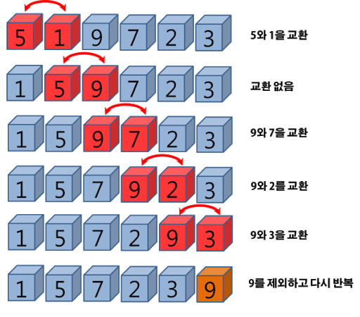
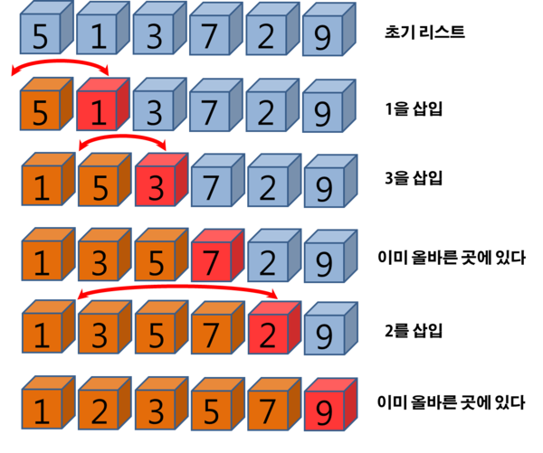
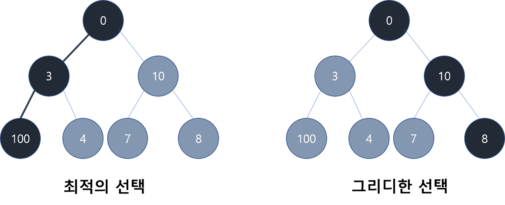
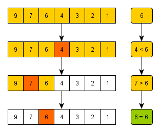
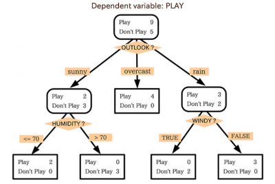

## ✔️ Section7: 정렬과 그리디, 결정알고리즘(이분검색)

- 투포인터 알고리즘, 슬라이딩 윈도우, 해쉬

| No. |             문항              | 진행 상황 |
| :-: | :---------------------------: | :-------: |
| 01  |           선택 정렬           |    ☑️     |
| 02  |           버블 정렬           |    ☑️     |
| 03  |         Special Sort          |    ☑️     |
| 04  |           삽입 정렬           |    ☑️     |
| 05  |              LRU              |    ☑️     |
| 06  |        장난꾸러기 현수        |    ☑️     |
| 07  |           좌표 정렬           |    ☑️     |
| 08  |          회의실 배정          |    ☑️     |
| 09  |            결혼식             |    ☑️     |
| 10  |           이분검색            |    ☑️     |
| 11  |  뮤직비디오 (결정 알고리즘)   |    ☑️     |
| 12  | 마구간 정하기 (결정 알고리즘) |    ☑️     |

## 정렬

### 선택 정렬 (Selection Sort)


- 제자리 정렬 알고리즘의 하나
- 입력 배열(정렬 전 값) 이외에 다른 추가메모리를 요구하지 않는 정렬 방법

```
1️⃣ 주어진 리스트 중에서 최소값을 찾는다.
2️⃣ 그 값을 맨 앞에 위치한 값과 교체한다.
3️⃣ 맨 처음 위치를 뺀 나머지 리스트에 대해 같은 작업을 수행한다.
4️⃣ 하나의 원소만 남을 때까지 위의 1-3 과정을 반복한다.

👩‍🏫 해당 순서에 원소를 넣을 위치는 이미 정해져 있는 상태에서, 어떤 원소를 넣을지 선택하는 것입니다.
```

> 장점

- 알고리즘이 단순하기 때문에 메모리가 제한적인 경우에 사용하면 성능 상 이점을 갖는다.
- 자료 이동 횟수가 미리 결정된다.

> 단점

- 안정성을 만족하지 않는다. ➡️ 값이 같은 레코드가 있는 경우 상대적 위치가 변경될 수 있다.

### 버블 정렬 (Bubble Sort)



```
👩‍🏫 기본 개념은 선택 정렬과 유사합니다.
```

- 서로 인접한 두 원소를 검사하여 정렬하는 알고리즘
  - 인접한 두 개의 레코드를 비교하여 크기가 순서대로 되어 있지 않은 경우 서로 교환한다.

```
1️⃣ 배열의 두 수(a, b)를 선택한 뒤 두 수가 정렬되면 두고 아니라면 두 수를 바꾼다.
    - 오름차순으로 정렬할 때는 <code>a<b</code>이어야 정렬된 것
    - 내림차순으로 정렬할 때는 <code>a>b</code>이어야 정렬된 것
2️⃣ 1회전을 수행하고 나면 가장 큰 자료가 맨 뒤로 이동하게 된다.
3️⃣ 2회전에서 맨 끝의 자료가 정렬에서 제외되고, 2회전 수행 후에는 뒤에서 두 번쨰 자료가 정렬에서 제외 된다.
4️⃣ 정렬을 1회전 수행할 때마다 정렬에서 제외되는 데이터가 하나씩 늘어난다.

```

> 장점

- 구현이 매우 간단하다.

> 단점

- 순서에 맞지 않는 요소를 인접 요소와 교환한다.
- 가장 왼쪽의 요소가 반대편 끝으로 이동하기 위해서는 배열의 모든 다른 요소들과 교환되어야 한다.
- 특정 요소가 최종 정렬 위치에 이미 있더라도 교환될 가능성도 있다.
  ➡️ 자료의 **교환(SWAP)**이 자료의 **이동(MOVE)**보다 복잡하여
  버블 정렬은 단순성에도 불구하고 **_거의 쓰이지 않는다_**.

### 삽입 정렬



- 자료 배열의 모든 요소를 앞에서부터 차례대로 이미 정렬된 배열 부분과 비교한 뒤 자신의 이미 정렬된 요소의 배열 부분과 비교해 자신의 위치를 찾아 삽입함으로써 정렬을 완성하는 알고리즘
- 매 순서마다 해당 원소를 삽입할 수 있는 위치를 찾아 해당 위치에 삽입한다.

```
1️⃣ 두 번쨰 자료부터 시작하여 왼쪽의 자료들과 비교해 삽입할 위치를 지정한다.
2️⃣ 지정된 위치로 자료를 뒤로 옮기고 지정한 자리에 자료를 삽입해 정렬한다.
3️⃣ 두 번쨰 자료는 첫 번째 자료, 세 번째 자료는 두 번째와 첫 번째 자료, ...와 비교한 후
    자료가 삽입될 위치를 찾았다면 그 위치에 자료를 삽입하기 위해 자료를 한 칸씩 뒤로 이동시킨다.
```

> 장점

- 안전한 정렬 방법
- 레코드 수가 적으면 알고리즘이 간단하므로 다른 복잡한 정렬 방법에 비해 유리하다.
- 대부분의 레코드가 이미 정렬되어 있다면 효율적이다.

> 단점

- 비교적 많은 레코드의 이동을 수반한다.
- 레코드 수가 많거나 크기가 클 경우 부적합하다.

## 그리디 (Greedy)



- 최적의 답을 구하는 데 사용되는 방법
- 선택의 순간마다 당장 눈 앞에 보이는 최적의 상황만을 쫓아 최종적인 해답에 도달하는 방법
- 여러 경우 중 하나를 선택해야 할 때마다 그 순간에 최적이라고 생각되는 최적의 경우를 선택하는 방식으로 진행하여 최종적 해답에 도달한다.
  - 이때 순간마다 하는 선택은 그 순간에 대해 **지역적으로는** 최적이다.
  - 하지만 이 선택들을 통해 만든 최종적(전역적) 해답이 최적이라는 보장은 없다.

```
1️⃣ 선택 절차
    : 현재 상태에서의 최적의 해답을 선택한다.
2️⃣ 적절성 검사
    : 선택된 해가 문제의 조건을 만족하는지 검사한다.
3️⃣ 해답 검사
    : 원래의 문제가 해결되었는지 검사한다. ➡️ 해결되지 않았다면 1번 과정으로 돌아가 반복한다.
```

### 탐욕 알고리즘이 잘 작동하는 문제의 특징

아래의 두 조건을 충족한다.

> 탐욕스런 선택 조건

- 앞의 선택이 이후의 선택에 영향을 주지 않는다.

> 최적 부분 구조 조건

- 문제에 대한 최적해가 부분 문제에 대해서도 최적해여야 한다.

### 위의 조건들이 성립하지 않는 경우

- 최적해를 구할 수 없다.

- 하지만 이러한 경우에도 탐욕 알고리즘은 근사 알고리즘으로 사용할 수 있다.

> 근사 알고리즘

- 어떤 최적화 문제에 대한 해의 근사값을 구하는 알고리즘
- 가장 최적화된 값을 구할 수는 없지만 비교적 빠른 시간에 어느 정도 보장된 근사 해를 계산할 수 있다.

## 결정 알고리즘 (이분 검색)

### 이분 검색 (Binray Search Algorithm)



- 오름차순으로 정렬된 리스트에서 특정한 값의 위치를 찾는 알고리즘

```
1️⃣ 처음 중간의 값을 임의의 값으로 선택한다.
2️⃣ 1에서 선택한 중간 값이 찾는 값보다 크면 그 값은 새로운 최댓값, 작으면 그 값은 새로운 최솟값이 된다.
    - 중간 값이 찾는 값과 같으면 종료한다.
    - 찾는 값이 더 크면 중간 값 기준 배열의 오른쪽 구간을 대상으로 탐색한다.
    - 중간 값이 더 크면 중간 값 기준 배열의 왼쪽 구간을 대상으로 탐색한다.
3️⃣ 값을 찾거나 간격이 비어있을 떄까지 반복한다.
```

> 장점

- 검색이 반복될 때마다 목표값을 찾을 확률이 두 배가 되어 속도가 빠르다.

> 단점

- 검색 원리 상 정렬된 리스트에만 사용할 수 있다.

```
🤔 이분 탐색 알고리즘은 어떤 방식으로 문제에 출제될 수 있을까?
```

### 결정 알고리즘 (Decision Algorithm)



- 이분 검색을 기반으로 한다.
- boolean 타입으로 답하게 되는 문제를 말한다.

> Parametric Search

- 특정 조건을 만족하며 동시에 가장 적합한 변수 값을 찾는 문제에서 활용된다.
- 최적화 문제(문제의 상황을 만족하는 특정 변수의 최솟값, 최댓값을 구하는 문제)를 결정 알고리즘으로 푸는 것
  - 범위 내에서 조건을 만족하는 가장 큰 값을 찾는 최적화 문제에서 이분 탐색으로 결정 문제를 해결하며 범위를 좁혀갈 수 있다.
- 입력 데이터가 많거나 탐색 범위의 크기가 매우 넓을 때 사용하면 좋다.
