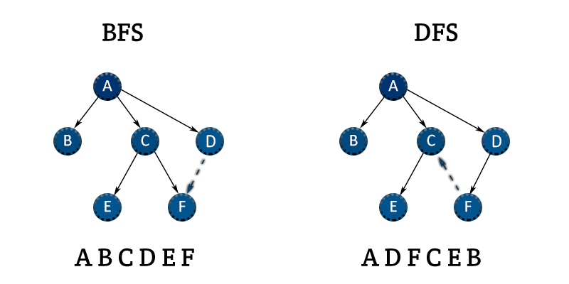
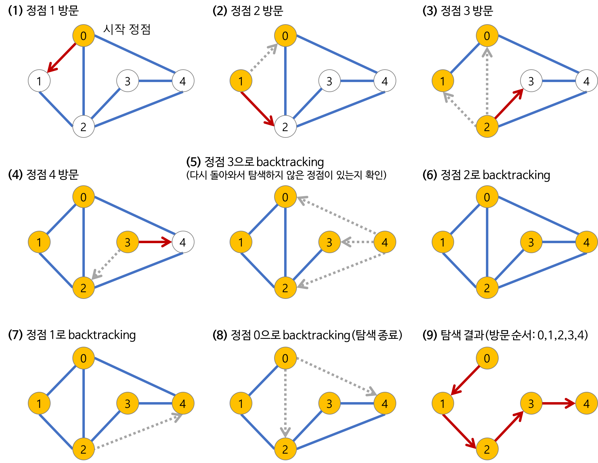

## ✔️ Section8: 재귀함수와 완전 탐색 (DFS: 깊이 우선 탐색)

| No. |          문항          | 진행 상황 |
| :-: | :--------------------: | :-------: |
| 01  | 재귀함수와 스택 프레임 |    ⬜     |
| 02  |      이진수 출력       |    ⬜     |
| 03  |     이진 트리 순회     |    ⬜     |
| 04  |    부분 집합 구하기    |    ⬜     |
| 05  |  합이 같은 부분 집합   |    ⬜     |
| 06  |      바둑이 승차       |    ⬜     |
| 07  |    최대 점수 구하기    |    ⬜     |
| 08  |       중복 순열        |    ⬜     |
| 09  |       동전 교환        |    ⬜     |
| 10  |      순열 구하기       |    ⬜     |
| 11  |        팩토리얼        |    ⬜     |
| 12  |         조합수         |    ⬜     |
| 13  |     수열 추측하기      |    ⬜     |
| 14  |      조합 구하기       |    ⬜     |
| 15  |      수들의 조합       |    ⬜     |

## 완전 탐색 기법을 활용하는 방법

### 1️⃣ Brue-Force 기법

- S04 참조

### 2️⃣ 순열 (Permutation)

- 임의의 수열이 있을 떄 그것을 다른 순서로 연산하는 방법
- 같은 데이터가 입력된 수열이라도 순서에 의미가 있고 이를 통해 연결되는 수열을 찾아낼 수 있는 경우를 계산할 수 있다.

### 재귀함수 (Recursion)

- 정의 단계에서 자신을 재참조하는 함수
- 하나의 함수에서 자신을 다시 호출하여 작업을 수행하는 방식으로 주어진 문제를 푸는 방법

> 주의 사항

1. 재귀를 탈출하기 위한 탈출 조건이 필요하다.
2. 현재 함수의 상태를 저장하는 parameter가 필요하다.
3. return 문을 신경써야 한다.

### Bitmask

- 비트 연산을 통해 부분 집합을 표현하는 방법

> 비트 연산자

- & (AND)
- | (OR)
- ~ (NOT): 1이면 0, 0이면 1
- ^ (XOR): 둘의 관계가 다르면 1, 같으면 0
- <<, >> (SHIFT): 해당 방향으로 원 비트를 특정 값만큼 밀어버리는 행위

### BFS, DFS 사용하기

- 그래프 자료 구조에서 모든 정점을 탐색하기 위한 방법

> 그래프

- 객체들이 쌍으로 연관되어 집합을 이루는 구조
- 노드들이 부모/자식 관계로 연결되어 있는 트리 구조와 유사하다.
- 내부적으로 부분 그래프로 이루어진다.

> 그래프 탐색

- 하나의 정점으로부터 시작하여 차례대로 모든 정점들을 한 번씩 방문하는 것

## DFS (Depth First Search)

> 깊이 우선 탐색

- 루트 노드 혹은 다른 임의의 노드에서 시작해 다음 분기로 넘어가기 전 해당 분기를 완벽하게 탐색하는 방법
  - 한 방향으로 갈 수 있을 때까지 계속 가다가 더 이상 갈 수 없게 되면 가장 가까운 갈림길로 돌아와 다른 방향으로 탐색을 다시 진행하는 방식
  - 넓게 탐색하기 전 깊게 탐색하는 것
  - 모든 노드를 방문하고자 하는 경우에 선택하는 방식이다.
- DFS가 BFS보다 조금 더 간단하다.
- 단순 검색 속도 자체는 BFS에 비해 느리다.

> 특징

- 자기 자신을 호출하는 순환 알고리즘의 형태를 가진다.
- 전위 순회를 포함한 다른 형태의 트리 순회는 모두 DFS의 한 종류이다.
  - 전위 순회: 루트 노드를 먼저 방문하는 것
- 그래프 탐색의 경우 어떤 노드를 방문했었는지 여부를 반드시 검사해야 한다.
  - 하지 않을 경우 무한 루프에 빠질 위험이 있다.

> 구현 과정

1. a 노드(시작 위치)를 방문한다.

- 이때 방문한 노드는 방문했다고 표시한다.

2. a와 인접한 노드들을 차례로 순회한다.

- a와 인접한 노드가 없을 경우 종료한다.

3. a와 인접한 b 노드를 방문했다면, 다른 노드를 방문하기 전 b의 이웃 노드들을 전부 방문한다.

- b를 시작점으로 DFS를 다시 시작해 b의 이웃 노드들을 방문한다.

4. b의 분기를 모두 확인한 뒤 다시 a에 인접한 정점들 중 아직 방문이 안 된 정점을 찾는다.

- b의 분기를 완벽하게 탐색한 뒤에 a의 다른 이웃 노드를 방문할 수 있다.
- 미방문 노드가 없을 경우 종료한다. (있다면 그 정점을 기준으로 다시 DFS 시작)
