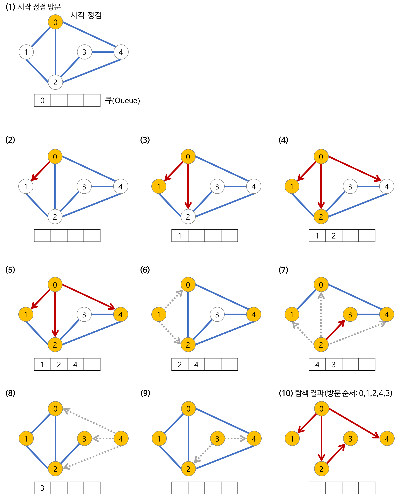

## ✔️ Section9: 그래프와 탐색(DFS, BFS: 너비 우선 탐색)

| No. |                      문항                       | 진행 상황 |
| :-: | :---------------------------------------------: | :-------: |
| 01  |               그래프와 인접 행렬                |    ⬜     |
| 02  |  경로 탐색(DFS-인접행렬: 노드 개수가 적을 때)   |    ⬜     |
| 03  | 경로 탐색 (DFS-인접리스트: 노그 개수가 많을 때) |    ⬜     |
| 04  |                    미로 탐색                    |    ⬜     |
| 05  |         이진 트리 너비 우선 탐색 (BFS)          |    ⬜     |
| 06  |                송아지 찾기 (BFS)                |    ⬜     |
| 07  |              섬나라 아일랜드 (DFS)              |    ⬜     |
| 08  |              섬나라 아일랜드 (BFS)              |    ⬜     |

## BFS (Breadth First Search)

> 너비 우선 탐색

- 루트 노드 혹은 다른 임의의 노드에서 시작해서 인접한 노드를 먼저 탐색하는 방법이다.
  - 시작 정점으로부터 가까운 정점을 먼저 방문하고 멀리 떨어져 있는 정점을 나중에 방문하는 순회 방법이다.
  - 깊이 탐색하기 전에 넓게 탐색한다.
  - 두 노드 사이의 최단 경로 혹은 임의의 경로를 찾고 싶을 때 선택하는 방법이다.
- BFS가 DFS보다 좀 더 복잡하다.

> 특징

- 직관적이지 않은 편이다.
  - 시작 노드에서부터 거리에 따라 단계별로 탐색한다.
- 재귀적으로 동작하지 않는다.
- 무한루프에 빠지지 않도록 어떤 노드를 방문했는지 여부를 반드시 검사해야 한다.
- FIFO(선입선출) 방식으로 탐색한다.
  - 일반적으로 방문한 노드들을 차례로 저장한 후 꺼낼 수 있는 **QUEUE**를 사용해 구현한다.

> 구현 과정

1. 깊이가 1인 모든 노드를 방문한다.
2. 깊이가 2, 3, ... 인 노드를 순차적으로 방문한다.
3. 더 이상 방문할 깊이가 없으면 탐색을 마친다.
