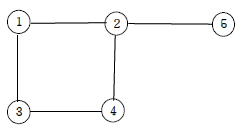
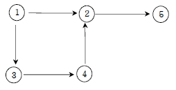
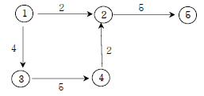
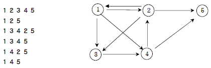
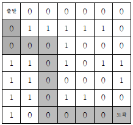
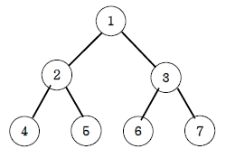
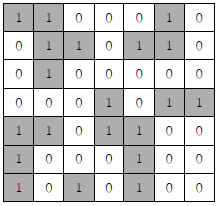

<h1>문제 이미지 모음</h1>

<h3>1. 그래프와 인접행렬</h3>

<h4>a. 무방향 그래프</h4>

<h4>b. 방향 그래프</h4>

<h4>c. 가중치 방향 그래프</h4>

<h3>2/3. 경로 탐색(인접리스트)</h3>

<h3>4. 미로탐색 (DFS)</h3>

<h3>5. 이진트리 넓이우선탐색(BFS)</h3>

<h3>7/8. 섬나라 아일랜드(DFS 활용)</h3>

