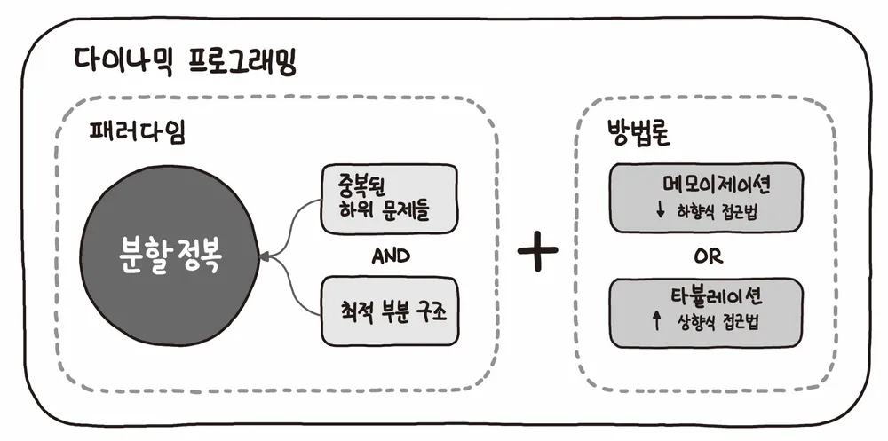

## ✔️ Section10: Dynamic Programming(동적 계획법)

| No. |                 문항                  | 진행 상황 |
| :-: | :-----------------------------------: | :-------: |
| 01  |              계단 오르기              |    ⬜     |
| 02  |             돌다리 건너기             |    ⬜     |
| 03  |       최대 부분 증가 수열(LIS)        |    ⬜     |
| 04  |       동전 교환(냅색 알고리즘)        |    ⬜     |
| 05  | 최대 점수 구하기 (냅색을 이용한 조합) |    ⬜     |

## 동적 계획법 (Dynamic PRogramming)

- 복잡한 문제를 간단한 여러 개의 문제로 나누어 푸는 방법
- 제약사항에 주어지는 숫자의 범위가 크고 경우의 수가 엄청 많은 문제들의 경우에 주로 사용되는 풀이 방식이다!
- 분할 정렬과 달리 쪼개진 작은 문제가 중복된다.

### 조건

> 부분 반복 문제

- 동적 계획법은 피보나치 수열로부터 등장했다.
  - 피보나치 수열: 대표적 재귀 함수
- 어떤 문제가 여러 개의 부분 문제로 쪼개질 수 있을 때 사용하는 용어이다.
- 항상 새로운 문제를 생성하기 보다 같은 부분 문제가 여러 번 재사용되거나 재귀 알고리즘을 통해 해결되는 문제를 일컫는다.

> 최적 부분 구조

- 작은 부분 문제에서 구한 최적의 답을 사용해 합쳐진 큰 문제의 최적의 답을 구할 수 있어야 함을 의미한다.

### 구현 방법

- 모든 작은 문제들을 한 번만 풀어야 하므로 정답을 구한 경우 메모가 필요하다.
- 더 큰 문제를 풀이할 때 동일한 작은 문제가 나타날 경우 앞서 메모한 결과값을 이용한다.

> 하향식 접근법 (Top-Down)

- 큰 문제를 작은 문제로 쪼개면서 풀어나가는 방식
- 메모이제이션(Memoization)P을 사용하여 DP를 구현하는 방식 중 하나이다.
- 재귀함수를 사용하여 구현한다.

> 상향식 접근법

- 가장 작은 부분의 해답을 구한 뒤 이를 저장하고 저장한 값을 사용하여 상위 문제를 풀어가는 방식
- 타블레이션(Tabulation)을 사용하여 DP를 구현하는 방식 중 하나이다.
- 반복문을 이용하여 구현한다.

### Memoization

- 동적 계획법의 핵심이 되는 기술이다.
- 컴퓨터 프로그램이 동일한 계산을 반복해야 할 때 이전에 계산한 값을 메모리에 저장함으로써 동일한 계산의 반복 수행을 제거하여 프로그램 실행 속도를 빠르게 하는 기술
- 계산한 값을 저장해 반복 수행 시 연산 없이 저장된 값을 사용한다.

### Tabulation

- 하위 문제부터 천천히 해결하면서 더 큰 문제를 해결하는 기법이다.
- 작은 문제부터 큰 문제까지 하나하나 테이블을 채워간다는 의미를 갖는다.
