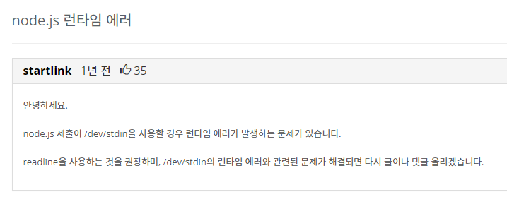

## Template

### <code>fs</code>

```js
const fs = require("fs");
const input = fs
  .readFileSync("./dev/stdin")
  .toString()
  .trim()
  .split("\n")
  .map((v) => v.trim());

// 내가 푼 코드

console.log();
```

- node.js 파일 시스템 모듈을 사용하는 방식이다.
- 모듈이기 때문에 <code>require</code>로 불러온다.



- 런타임 에러로 인해 이 방식 대신 <code>readline</code>을 사용하는 것이 권장된다.

### <code>readline</code>

```js
const readline = require("readline").createInterface({
  input: process.stdin,
  output: process.stdout,
});

let input = [];

readline
  .on("line", function (line) {
    input = line.split(" ").map((el) => parseInt(el));
  })
  .on("close", function () {
    // 내가 푼 코드
    process.exit();
  });
```

```
🥸 readline 사용이 권장되나 보통 fs 모듈을 사용해도 에러가 나지 않는 경우가 많으므로 골라서 사용하면 될 것 같다.
```
